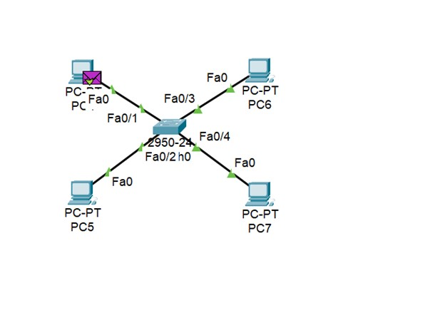
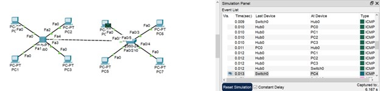
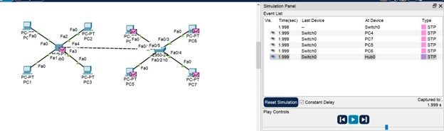
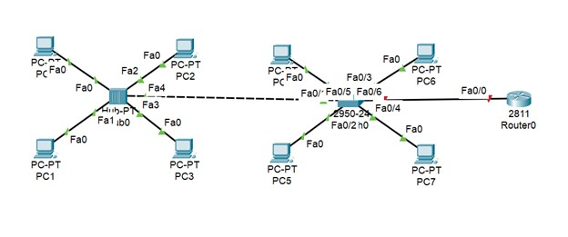

---
## Front matter
title: "Лабораторная работа №1"
author: "Уткина Алина Дмитриевна"

## Generic otions
lang: ru-RU
toc-title: "Содержание"

## Bibliography
bibliography: bib/cite.bib
csl: pandoc/csl/gost-r-7-0-5-2008-numeric.csl

## Pdf output format
toc: true # Table of contents
toc-depth: 2
lof: true # List of figures
fontsize: 12pt
linestretch: 1.5
papersize: a4
documentclass: scrreprt
## I18n polyglossia
polyglossia-lang:
  name: russian
  options:
	- spelling=modern
	- babelshorthands=true
polyglossia-otherlangs:
  name: english
## I18n babel
babel-lang: russian
babel-otherlangs: english
## Fonts
mainfont: PT Sans
romanfont: PT Sans
sansfont: PT Sans
monofont: PT Sans
mainfontoptions: Ligatures=TeX
romanfontoptions: Ligatures=TeX
sansfontoptions: Ligatures=TeX,Scale=MatchLowercase
monofontoptions: Scale=MatchLowercase,Scale=0.9
## Biblatex
biblatex: true
biblio-style: "gost-numeric"
biblatexoptions:
  - parentracker=true
  - backend=biber
  - hyperref=auto
  - language=auto
  - autolang=other*
  - citestyle=gost-numeric
## Pandoc-crossref LaTeX customization
figureTitle: "Рис."
tableTitle: "Таблица"
listingTitle: "Листинг"
lofTitle: "Список иллюстраций"
lotTitle: "Список таблиц"
lolTitle: "Листинги"
## Misc options
indent: true
header-includes:
  - \usepackage{indentfirst}
  - \usepackage{float} # keep figures where there are in the text
  - \floatplacement{figure}{H} # keep figures where there are in the text
---

# Цель работы

Целью данной работы является приобретение практических навыков установки инструмента моделирования конфигурации сети Cisco Packet Tracer, знакомство с его интерфейсом.

# Задание

1. Установить на домашнем устройстве Cisco Packet Tracer. 

2. Построить простейшую сеть в Cisco Packet Tracer, провести простейшую настройку оборудования.

# Выполнение лабораторной работы

## Установка Cisco Packet Tracer.

Для ОС типа Windows требуется блокировать для Packet Tracer доступ в Интернет. Создадим правило (рис. [-@fig:009]):

   - Откроем «Панель управления».
   - Откроем пункт «Брандмауэр Защитника Windows» или просто Брандмауэр Windows (рис. [-@fig:001]).
   - В открывшемся окне нажмем «Дополнительные параметры». Откроется окно брандмауэра в режиме повышенной безопасности (рис. [-@fig:002]).
   - Выберем «Правило для исходящего подключения» (рис. [-@fig:003]).
   - Затем «Создать правило», «Для программы» и «Далее» (рис. [-@fig:004]).
   - Укажем путь к исполняемому файлу программы, которой нужно запретить доступ в Интернет. В данном случае путь к установленному у вас в ОС Packet Tracer (рис. [-@fig:005]).
   - В следующем окне оставим отмеченным пункт «Блокировать подключение» (рис. [-@fig:006]).
   - В следующем окне отметим, для каких сетей выполнять блокировку (рис. [-@fig:007]).
   - Укажем имя правила и нажмем «Готово» (рис. [-@fig:008]).

{#fig:001 width=70%}

{#fig:002 width=70%}

{#fig:003 width=70%}

{#fig:004 width=70%}

{#fig:005 width=70%}

{#fig:006 width=70%}

{#fig:007 width=70%}

{#fig:008 width=70%}

{#fig:009 width=70%}

Таким образом при открытии Packet Tracer не будет получать доступ в Интернет и требовать аутентификацию (рис. [-@fig:010]).

{#fig:010 width=70%}

## Построение простейшей сети

Создадим новый проект lab_PT-01.pkt. В рабочем пространстве разместим концентратор (Hub-PT) и четыре оконечных устройства PC. Соединим оконечные устройства с концентратором прямым кабелем (рис. [-@fig:011]). Щёлкнув последовательно на каждом оконечном устройстве, зададим статические IP-адреса 192.168.1.11 (рис. [-@fig:012]), 192.168.1.12 (рис. [-@fig:013]), 192.168.1.13 (рис. [-@fig:014]), 192.168.1.14 (рис. [-@fig:015]) с маской подсети 255.255.255.0 

{#fig:011 width=70%}

{#fig:012 width=70%}

{#fig:013 width=70%}

{#fig:014 width=70%}

{#fig:015 width=70%}

В основном окне проекта перейдем из режима реального времени (Realtime) в режим моделирования (Simulation). Выберем на панели инструментов мышкой «Add Simple PDU (P)» и щёлкнем сначала на PC0, затем на PC2. В рабочей области появились два конверта, обозначающих пакеты, в списке событий на панели моделирования появилисья два события, относящихся к пакетам ARP и ICMP соответственно (рис. [-@fig:016]).

{#fig:016 width=70%}

На панели моделирования нажмем кнопку «Play» и проследим за движением пакетов ARP и ICMP от устройства PC0 до устройства PC2 и обратно. Щёлкнув на строке события, откроем окно информации о PDU и изучим, что происходит на уровне модели OSI при перемещении пакета. Используя кнопку «Проверь себя» (Challenge Me) на вкладке OSI Model, ответим на вопросы (рис. [-@fig:017]).

{#fig:017 width=70%}

Откроем вкладку с информацией о PDU (рис. [-@fig:018]). Используется EthernetII. При передвижении пакета меняются MAC-адреса источника и назначения. Они записываются в hex (source mac: 0001.C787.5BED, target mac: 0000.0000.0000). 

{#fig:018 width=70%}

Очистим список событий, удалив сценарий моделирования. Выберем на панели инструментов мышкой «Add Simple PDU (P)» и щёлкнем сначала на PC0, затем на PC2. Снова выберем на панели инструментов мышкой «Add Simple PDU (P)» и щёлкнем сначала на PC2, затем на PC0. На панели моделирования нажмем кнопку «Play» и проследим за возникновением коллизии (рис. [-@fig:019]), (рис. [-@fig:020]).

{#fig:019 width=70%}

{#fig:020 width=70%}

Перейдем в режим реального времени (Realtime). В рабочем пространстве разместим коммутатор (Cisco 2950-24) и 4 оконечных устройства PC. Соединим оконечные устройства с коммутатором прямым кабелем (рис. [-@fig:021]). Щёлкнув последовательно на каждом оконечном устройстве, зададим статические IP-адреса 192.168.1.21 (рис. [-@fig:022]), 192.168.1.22 (рис. [-@fig:023]), 192.168.1.23 (рис. [-@fig:024]), 192.168.1.24 (рис. [-@fig:025]) с маской подсети 255.255.255.0.

{#fig:021 width=70%}

{#fig:022 width=70%}

{#fig:023 width=70%}

{#fig:024 width=70%}

{#fig:025 width=70%}

В основном окне проекта перейдем из режима реального времени (Realtime) в режим моделирования (Simulation). Выберем на панели инструментов мышкой «Add Simple PDU (P)» и щёлкнем сначала на PC4, затем на PC6. В рабочей области появились два конверта, обозначающих пакеты, в списке событий на панели моделирования появились два события, относящихся к пакетам ARP и ICMP соответственно. На панели моделирования нажмем кнопку «Play» и проследим за движением пакетов ARP и ICMP от устройства PC4 до устройства PC6 и обратно (рис. [-@fig:026]), (рис. [-@fig:027]), (рис. [-@fig:028]), (рис. [-@fig:029]). 

{#fig:026 width=70%}

{#fig:027 width=70%}

{#fig:028 width=70%}

{#fig:029 width=70%}

Очистим список событий, удалив сценарий моделирования. Выберем на панели инструментов мышкой «Add Simple PDU (P)» и щёлкнем сначала на PC4, затем на PC6. Снова выберем на панели инструментов мышкой «Add Simple PDU (P)» и щёлкнем сначала на PC6, затем на PC4. На панели моделирования нажмем кнопку «Play» и проследим за движением пакетов (рис. [-@fig:030]).

{#fig:030 width=70%}

Перейдем в режим реального времени (Realtime). В рабочем пространстве соединим кроссовым кабелем концентратор и коммутатор. Перейдем в режим моделирования (Simulation). Очистим список событий, удалив сценарий моделирования. Выберем на панели инструментов мышкой «Add Simple PDU (P)» и щёлкнем сначала на PC0, затем на PC4. Снова выберем на панели инструментов мышкой «Add Simple PDU (P)» и щёлкнем сначала на PC4, затем на PC0. На панели моделирования нажмем кнопку «Play» и проследим за движением пакетов (рис. [-@fig:031]), (рис. [-@fig:032]), (рис. [-@fig:033]), (рис. [-@fig:034]), (рис. [-@fig:035]), (рис. [-@fig:036]), (рис. [-@fig:037]), (рис. [-@fig:038]), (рис. [-@fig:039]). 

{#fig:031 width=70%}

{#fig:032 width=70%}

{#fig:033 width=70%}

{#fig:034 width=70%}

{#fig:035 width=70%}

{#fig:036 width=70%}

{#fig:037 width=70%}

{#fig:038 width=70%}

{#fig:039 width=70%}

Очистим список событий, удалив сценарий моделирования. На панели моделирования нажмем «Play» и в списке событий получим пакеты STP (рис. [-@fig:040]), (рис. [-@fig:041]). 

{#fig:040 width=70%}

{#fig:041 width=70%}

Перейдем в режим реального времени (Realtime). В рабочем пространстве добавим маршрутизатор (Cisco 2811). Соединим прямым кабелем коммутатор и маршрутизатор (рис. [-@fig:042]). Щёлкнем на маршрутизаторе и на вкладке его конфигурации пропишем статический IP-адрес 192.168.1.254 с маской 255.255.255.0 (рис. [-@fig:043]), затем активируем порт, поставив галочку «On» напротив «Port Status». 

{#fig:042 width=70%}

{#fig:043 width=70%}

Перейдем в режим моделирования (Simulation). Очистим список событий, удалив сценарий моделирования. Выберем на панели инструментов мышкой «Add Simple PDU (P)» и щёлкнем сначала на PC3, затем на маршрутизаторе. На панели моделирования нажмем кнопку «Play» и проследим за движением пакетов ARP, ICMP, STP и CDP (рис. [-@fig:044]), (рис. [-@fig:045]), (рис. [-@fig:046]), (рис. [-@fig:047]), (рис. [-@fig:048]). 

{#fig:044 width=70%}

{#fig:045 width=70%}

{#fig:046 width=70%}

{#fig:047 width=70%}

{#fig:048 width=70%}

# Выводы

В ходе данной лабораторной работы были приобретены практические навыки установки инструмента моделирования конфигурации сети Cisco Packet Tracer, также мы познакомились с его интерфейсом.