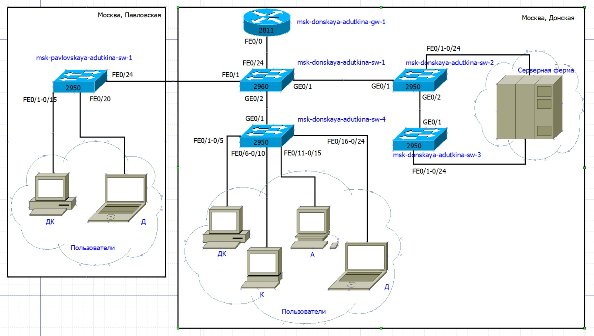
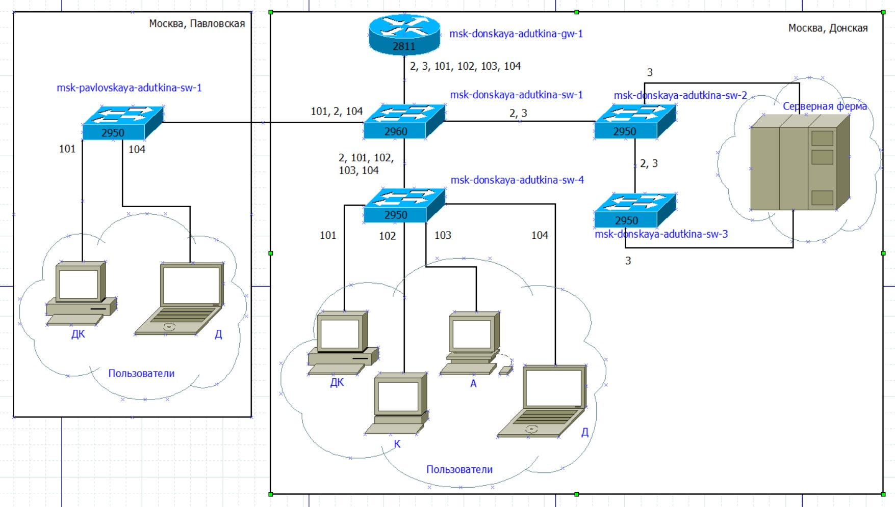
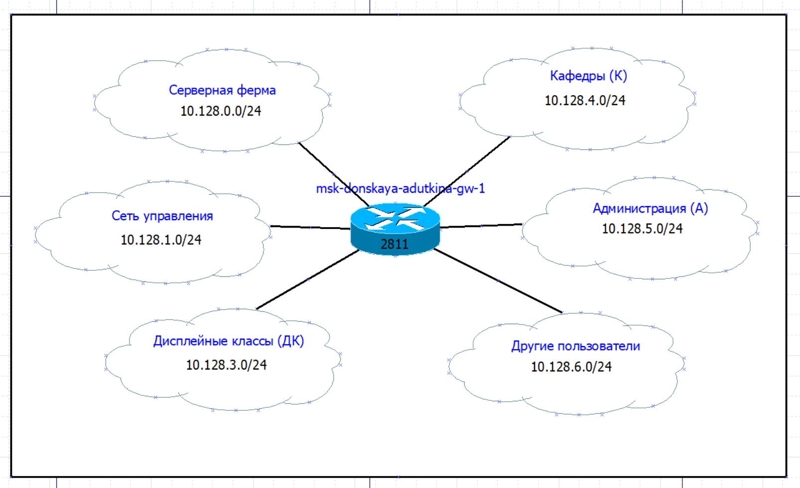

---
## Front matter
title: "Лабораторная работа №3"
author: "Уткина Алина Дмитриевна"

## Generic otions
lang: ru-RU
toc-title: "Содержание"

## Bibliography
bibliography: bib/cite.bib
csl: pandoc/csl/gost-r-7-0-5-2008-numeric.csl

## Pdf output format
toc: true # Table of contents
toc-depth: 2
lof: true # List of figures
fontsize: 12pt
linestretch: 1.5
papersize: a4
documentclass: scrreprt
## I18n polyglossia
polyglossia-lang:
  name: russian
  options:
	- spelling=modern
	- babelshorthands=true
polyglossia-otherlangs:
  name: english
## I18n babel
babel-lang: russian
babel-otherlangs: english
## Fonts
mainfont: PT Sans
romanfont: PT Sans
sansfont: PT Sans
monofont: PT Sans
mainfontoptions: Ligatures=TeX
romanfontoptions: Ligatures=TeX
sansfontoptions: Ligatures=TeX,Scale=MatchLowercase
monofontoptions: Scale=MatchLowercase,Scale=0.9
## Biblatex
biblatex: true
biblio-style: "gost-numeric"
biblatexoptions:
  - parentracker=true
  - backend=biber
  - hyperref=auto
  - language=auto
  - autolang=other*
  - citestyle=gost-numeric
## Pandoc-crossref LaTeX customization
figureTitle: "Рис."
tableTitle: "Таблица"
listingTitle: "Листинг"
lofTitle: "Список иллюстраций"
lotTitle: "Список таблиц"
lolTitle: "Листинги"
## Misc options
indent: true
header-includes:
  - \usepackage{indentfirst}
  - \usepackage{float} # keep figures where there are in the text
  - \floatplacement{figure}{H} # keep figures where there are in the text
---

# Цель работы

Целью данной работы является приобретение практических навыков планирования локальной сети организации.

# Задание

1. Используя графический редактор Dia, повторить схемы L1, L2, L3, а также сопутствующие им таблицы VLAN, IP-адресов и портов подключения оборудования планируемой сети 10.128.0.0/16.

2. При выполнении работы необходимо учитывать соглашение об именовании.

# Выполнение лабораторной работы

## Сеть 10.128.0.0/16

### Схемы

Откроем графический редактор Dia и в нем построим схему сети (рис. [-@fig:001]), (рис. [-@fig:002])? (рис. [-@fig:003]).

{#fig:001 width=70%}

{#fig:002 width=70%}

{#fig:003 width=70%}

### Таблица VLAN

| № VLAN | Имя VLAN    | Примечание                  |
|--------|-------------|-----------------------------|
| 1      | default     | Не используется             |
| 2      | management  | Для управления устройствами |
| 3      | servers     | Для серверной фермы         |
| 4-100  |             | Зарезервировано             |
| 101    | dk          | Дисплейные классы (ДК)      |
| 102    | departments | Кафедры                     |
| 103    | adm         | Администрация               |
| 104    | other       | Для других пользователей    |

### Таблица IP

| IP-адреса               | Примечание                    | VLAN |
|-------------------------|-------------------------------|------|
| 10.128.0.0/16           | Вся сеть                      |      |
| 10.128.0.0/24           | Серверная ферма               | 3    |
| 10.128.0.1              | Шлюз                          |      |
| 10.128.0.2              | Web                           |      |
| 10.128.0.3              | File                          |      |
| 10.128.0.4              | Mail                          |      |
| 10.128.0.5              | Dns                           |      |
| 10.128.0.6-10.128.0.254 | Зарезервировано               |      |
| 10.128.1.0/24           | Управление                    | 2    |
| 10.128.1.1              | Шлюз                          |      |
| 10.128.1.2              | msk-donskaya-adutkina-sw-1    |      |
| 10.128.1.3              | msk-donskaya-adutkina-sw-2    |      |
| 10.128.1.4              | msk-donskaya-adutkina-sw-3    |      |
| 10.128.1.5              | msk-donskaya-adutkina-sw-4    |      |
| 10.128.1.6              | msk-pavlovskaya-adutkina-sw-1 |      |
| 10.128.1.7-10.128.1.254 | Зарезервировано               |      |
| 10.128.2.0/24           | Сеть Point-to-Point           |      |
| 10.128.2.1              | Шлюз                          |      |
| 10.128.2.2-10.128.2.254 | Зарезервировано               |      |
| 10.128.3.0/24           | Дисплейные классы (ДК)        | 101  |
| 10.128.3.1              | Шлюз                          |      |
| 10.128.3.2-10.128.3.254 | Пул для пользователей         |      |
| 10.128.4.0/24           | Кафедры (К)                   | 102  |
| 10.128.4.1              | Шлюз                          |      |
| 10.128.4.2-10.128.4.254 | Пул для пользователей         |      |
| 10.128.5.0/24           | Администрация (А)             | 103  |
| 10.128.5.1              | Шлюз                          |      |
| 10.128.5.2-10.128.5.254 | Пул для пользователей         |      |
| 10.128.6.0/24           | Другие пользователи (Д)       | 104  |
| 10.128.6.1              | Шлюз                          |      |
| 10.128.6.2-10.128.6.254 | Пул для пользователей         |      |
 
### Таблица портов 

| Устройство           | Порт        | Примечание                    | Access VLAN | Trunk VLAN               |
|----------------------|-------------|-------------------------------|-------------|--------------------------|
| msk-donskaya-gw-1    | f0/1        | UpLink                        |             |                          |
|                      | f0/0        | msk-donskaya-adutkina-sw-1    |             | 2, 3, 101, 102, 103, 104 |
| msk-donskaya-sw-1    | f0/24       | msk-donskaya-adutkina-gw-1    |             | 2, 3, 101, 102, 103, 104 |
|                      | g0/1        | msk-donskaya-adutkina-sw-2    |             | 2, 3                     |
|                      | g0/2        | msk-donskaya-adutkina-sw-4    |             | 2, 101, 102, 103, 104    |
|                      | f0/1        | msk-pavlovskaya-adutkina-sw-1 |             | 2, 101, 104              |
| msk-donskaya-sw-2    | g0/1        | msk-donskaya-adutkina-sw-1    |             | 2, 3                     |
|                      | g0/2        | msk-donskaya-adutkina-sw-3    |             | 2, 3                     |
|                      | f0/1        | Web-server                    | 3           |                          |
|                      | f0/2        | File-server                   | 3           |                          |
| msk-donskaya-sw-3    | g0/1        | msk-donskaya-adutkina-sw-2    |             | 2, 3                     |
|                      | f0/1        | Mail-server                   | 3           |                          |
|                      | f0/2        | Dns-server                    | 3           |                          |
| msk-donskaya-sw-4    | g0/1        | msk-donskaya-adutkina-sw-1    |             | 2, 101, 102, 103, 104    |
|                      | f0/1–f0/5   | dk                            | 101         |                          |
|                      | f0/6–f0/10  | departments                   | 102         |                          |
|                      | f0/11–f0/15 | adm                           | 103         |                          |
|                      | f0/16–f0/24 | other                         | 104         |                          |
| msk-pavlovskaya-sw-1 | f0/24       | msk-donskaya-adutkina-sw-1    |             | 2, 101, 104              |
|                      | f0/1–f0/15  | dk                            | 101         |                          |
|                      | f0/20       | other                         | 104         |                          |

# Выводы

В ходе данной лабораторной работы были приобретены практические навыки планирования локальной сети организации.