---
## Front matter
title: "Лабораторная работа №5"
author: "Уткина Алина Дмитриевна"

## Generic otions
lang: ru-RU
toc-title: "Содержание"

## Bibliography
bibliography: bib/cite.bib
csl: pandoc/csl/gost-r-7-0-5-2008-numeric.csl

## Pdf output format
toc: true # Table of contents
toc-depth: 2
lof: true # List of figures
fontsize: 12pt
linestretch: 1.5
papersize: a4
documentclass: scrreprt
## I18n polyglossia
polyglossia-lang:
  name: russian
  options:
	- spelling=modern
	- babelshorthands=true
polyglossia-otherlangs:
  name: english
## I18n babel
babel-lang: russian
babel-otherlangs: english
## Fonts
mainfont: PT Sans
romanfont: PT Sans
sansfont: PT Sans
monofont: PT Sans
mainfontoptions: Ligatures=TeX
romanfontoptions: Ligatures=TeX
sansfontoptions: Ligatures=TeX,Scale=MatchLowercase
monofontoptions: Scale=MatchLowercase,Scale=0.9
## Biblatex
biblatex: true
biblio-style: "gost-numeric"
biblatexoptions:
  - parentracker=true
  - backend=biber
  - hyperref=auto
  - language=auto
  - autolang=other*
  - citestyle=gost-numeric
## Pandoc-crossref LaTeX customization
figureTitle: "Рис."
tableTitle: "Таблица"
listingTitle: "Листинг"
lofTitle: "Список иллюстраций"
lotTitle: "Список таблиц"
lolTitle: "Листинги"
## Misc options
indent: true
header-includes:
  - \usepackage{indentfirst}
  - \usepackage{float} # keep figures where there are in the text
  - \floatplacement{figure}{H} # keep figures where there are in the text
---

# Цель работы

Целью данной работы является приобретение основных навыков по настройке VLAN на коммутаторах сети.

# Задание

1. На коммутаторах сети настроить Trunk-порты на соответствующих интерфейсах, связывающих коммутаторы между собой.

2. Коммутатор msk-donskaya-sw-1 настроить как VTP-сервер и прописать на нём номера и названия VLAN.

3. Коммутаторы msk-donskaya-sw-2 — msk-donskaya-sw-4, msk-pavlovskaya-sw-1 настроить как VTP-клиенты, на интерфейсах указать принадлежность к соответствующему VLAN.

4. На серверах прописать IP-адреса.

5. На оконечных устройствах указать соответствующий адрес шлюза и прописать статические IP-адреса из диапазона соответствующей сети, следуя регламенту выделения ip-адресов.

6. Проверить доступность устройств, принадлежащих одному VLAN, и недоступность устройств, принадлежащих разным VLAN.

7. При выполнении работы необходимо учитывать соглашение об именовании.

# Выполнение лабораторной работы

Используя последовательность команд из примера по конфигурации Trunk-порта настроим Trunk-порты на соответствующих интерфейсах всех коммутаторов: 

 - msk-pavlovskaya-adutkina-sw-1 Fa0/24 (рис. [-@fig:001]),

 - msk-donskaya-adutkina-sw-1 Fa0/1, Gig0/1, Gig0/2 (рис. [-@fig:002]),

 - msk-donskaya-adutkina-sw-2 Gig0/1, Gig0/2 (рис. [-@fig:003]),

 - msk-donskaya-adutkina-sw-3 Gig0/1 (рис. [-@fig:004]),

 - msk-donskaya-adutkina-sw-4 Gig0/1 (рис. [-@fig:005]).

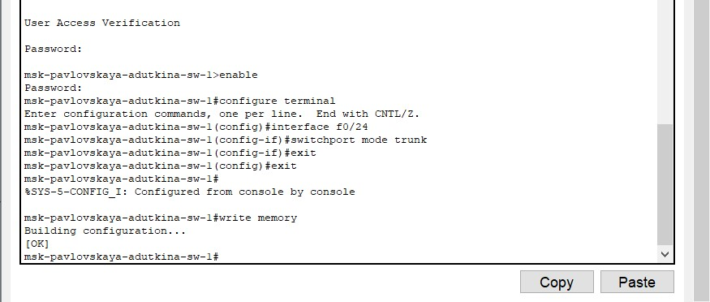{#fig:001 width=70%}

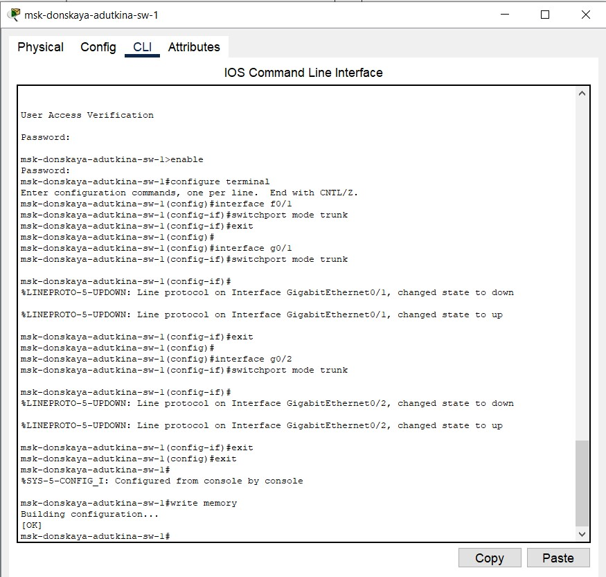{#fig:002 width=70%}

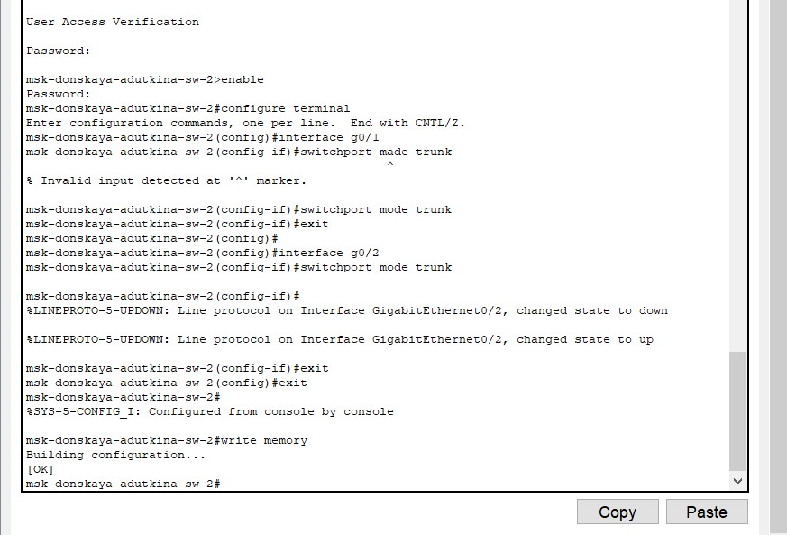{#fig:003 width=70%}

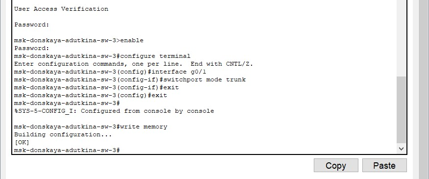{#fig:004 width=70%}

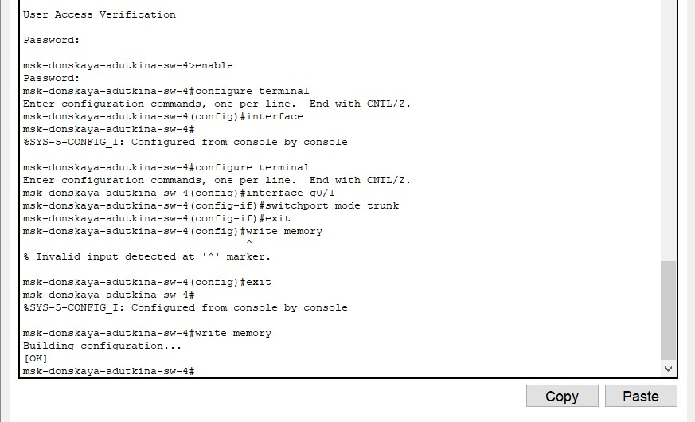{#fig:005 width=70%}

Используя последовательность команд по конфигурации VTP, настроим коммутатор msk-donskaya-adutkina-sw-1 как VTP-сервер и пропишем на нём номера и названия VLAN (рис. [-@fig:006]).

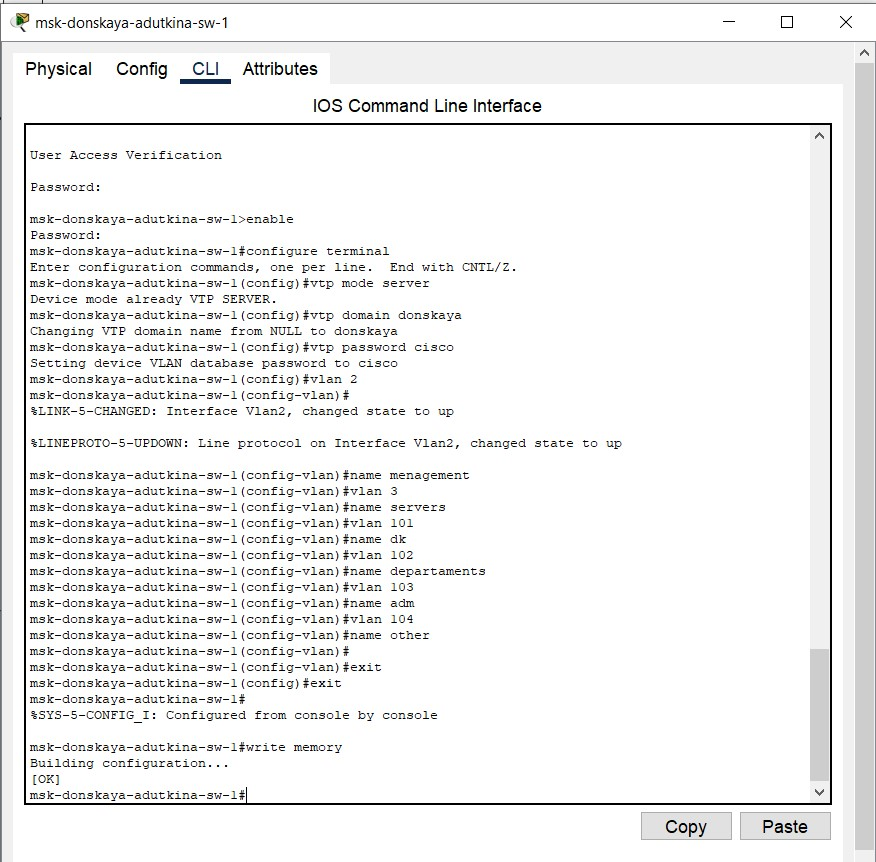{#fig:006 width=70%}

Используя последовательность команд по конфигурации диапазонов портов, настроим остальные коммутаторы как VTP-клиенты и на интерфейсах укажем принадлежность к VLAN:

 - msk-pavlovskaya-adutkina-sw-1 dk-101, other-104 (рис. [-@fig:007]),

 - msk-donskaya-adutkina-sw-2 web,file-3 (рис. [-@fig:008]),

 - msk-donskaya-adutkina-sw-3 mail-3 (рис. [-@fig:009]),

 - msk-donskaya-adutkina-sw-4 dk-101, dep-102, adm-103, other-104 (рис. [-@fig:010]).

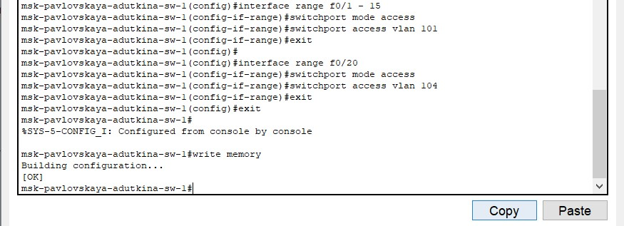{#fig:007 width=70%}

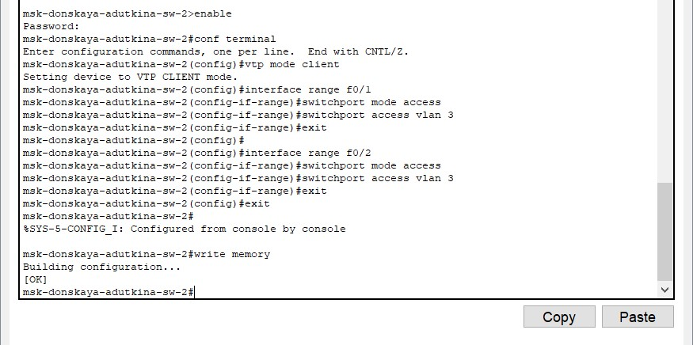{#fig:008 width=70%}

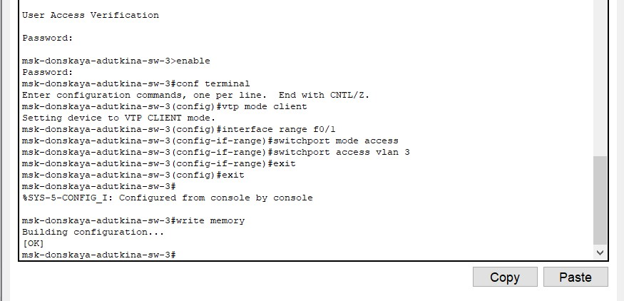{#fig:009 width=70%}

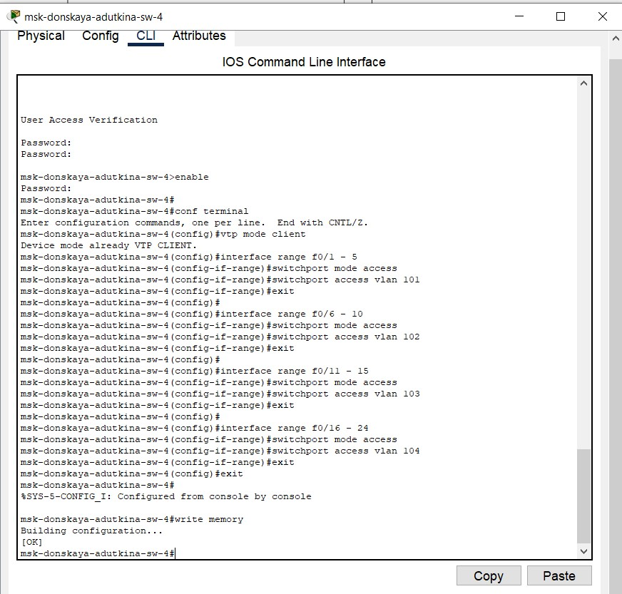{#fig:010 width=70%}

После указания статических IP-адресов на оконечных устройствах проверим с помощью команды ping доступность устройств, принадлежащих одному VLAN, и недоступность устройств, принадлежащих разным VLAN (рис. [-@fig:011]). Мы видим, что пакеты данных передать не удалось, а значит что-то было настроено не правильно, возможно, при подключении оконечных устройств.

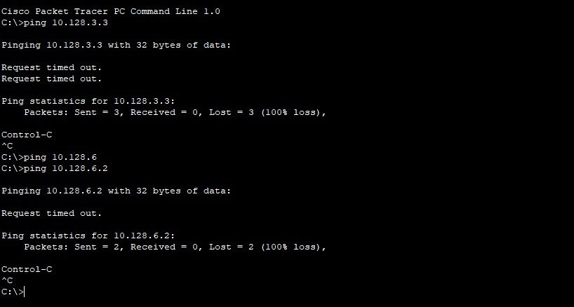{#fig:011 width=70%}

# Выводы

В ходе данной лабораторной работы были приобретены практические навыки по настройке VLAN на коммутаторах сети.